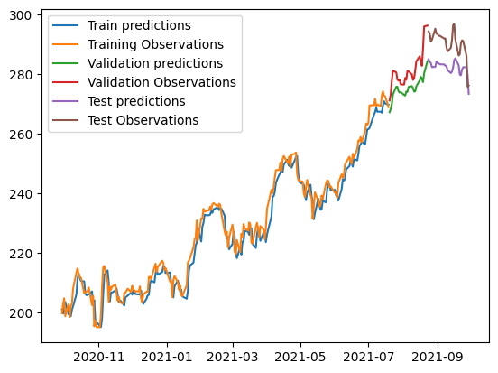

# Stock Price Prediction Project

A data science project exploring time series prediction on Accenture stock prices using LSTM neural networks.

## Overview
- Uses historical Accenture stock data from 2001-2021
- Uses historical Microsoft stock data from 1986-2021
- Implements LSTM neural networks for time series forecasting
- Focuses on predicting closing prices based on historical patterns

## Technologies Used
- Python
- PyTorch/TensorFlow 
- Pandas & NumPy for data manipulation
- Scikit-learn for preprocessing
- Matplotlib for visualization

## Purpose
This is a personal project to experiment with different machine learning approaches for financial time series prediction. The goal is to explore and compare various algorithms rather than build a production trading system.

## Status
<!-- Project is finished, here is an example of MSFT stocks versus predicted -->
Project is finished, here is an example of MSFT stocks versus predicted:
- 

## Conclusion
# SOMETIMES STOCK GO UP, SOMETIMES STOCK GO DOWN